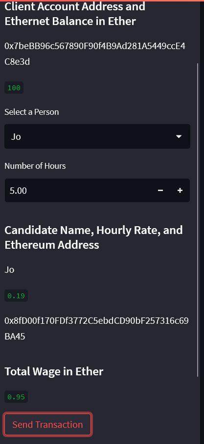
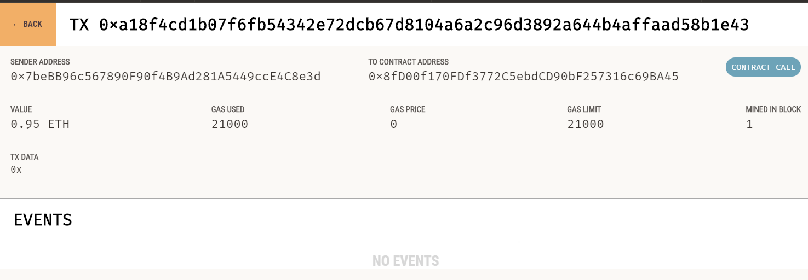
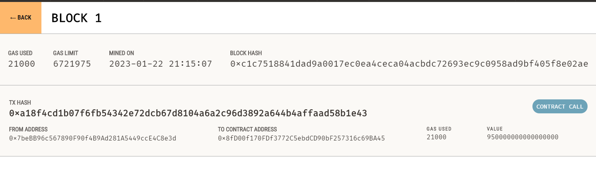
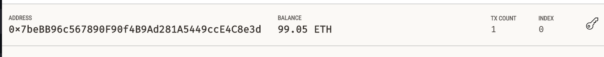

# **Fintech Bootcamp Challenge 19**
---


---
Developed a Fintech Finder application that customers can use to find professionals from among a list of candidates, hire them, and pay them.

The code enables customers to send cryptocurrency payments to fintech professionals. To develop and test the code assume the perspective of a Fintech Finder customer who is using the application to find a fintech professional and pay them for their work.


 ---
 ## **Technology**
 ---

 - Python 3.7
 - Python Code
 - Jupyter Labs 
 - Streamlit
 - Dataclasses
 - Web3
 - bip44
 - Ganache
 
 ---

## **Installation Guide**

---

Before running the application first install the following dependencies:
 
 ```python 
  pip install streamlit
  pip install dataclasses
  pip install typing
  pip install datetime
  pip install os
  pip install web3
  pip install dotenv
  pip install bip44
 ```
 
 You will also need to sign up for Ganache software and get a test wallet to transact in. 
 
 ---
 ## **Usage**

---

 To load the webpage and test the code. Run the following comand in your terminal: 
 
 ```python 
  streamlit run fintech_finder.py
  ```
The command opens a local streamlit webpage to test out the features of the code and transact etherium with the listed professionals at their stated rates.

---
 # **Results**
 
 In the streamlit powered webpage select the name of the hired professional and input the number of hours worked. Then click "Send Transaction" to sign the transaction and send Etherium coins to their wallet.
 


The transaction should show up in your Ganache wallet to verify the amount and the sender/receiver wallets.

Transaction:



Block: 



Balance:



---

### **Contributors**

- Gorovodskiy, Herman (ggorovod01@gmail.com) 


### **License**
---

MIT